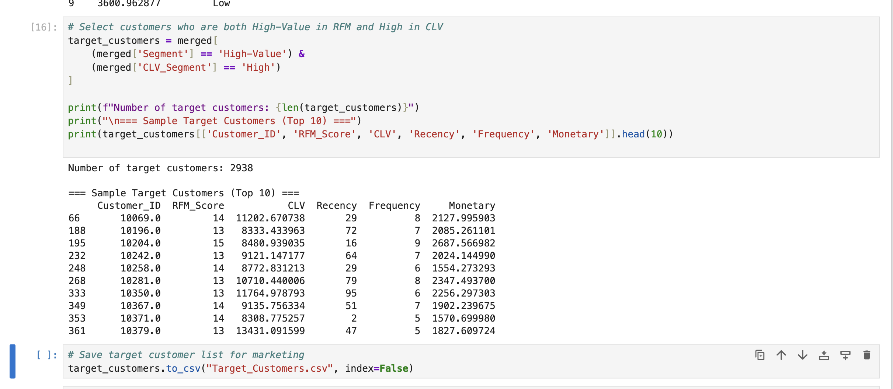

# High-Value Customer Insights – E-commerce Analysis

## Project Overview
This project demonstrates an **end-to-end customer analytics workflow** for an e-commerce dataset, including:

- **Data Acquisition & Cleaning** – Handling missing values, correcting data types, and removing duplicates.  
- **Exploratory Analysis** – Analyzing customer purchase patterns, demographics, and product performance.  
- **RFM Analysis** – Scoring customers by Recency, Frequency, and Monetary value.  
- **CLV (Customer Lifetime Value) Calculation** – Estimating long-term customer value based on purchasing behavior.  
- **Customer Segmentation** – Identifying high-value customers for targeted marketing strategies.  
- **Visualization Dashboard** – Developed in Tableau to present key insights.  

---

## Dataset Description
**Source:** [Kaggle – Retail Analysis Large Dataset](https://www.kaggle.com/datasets/sahilprajapati143/retail-analysis-large-dataset/data)  

The dataset contains **293,911 rows** and **30 columns**, covering customer demographics, transaction history, and product details.  

### Exploratory Analysis
- **Top cities by order volume:** Chicago (21,109), Portsmouth (19,648), San Francisco (11,938), Frankfurt (9,947), Boston (9,187).  
- **Top product categories by revenue:** Electronics (17.72M), Grocery (16.63M), Clothing (13.58M), Books (13.57M), Home Decor (13.49M).  
- **Gender distribution:** 62.18% Male, 37.82% Female.  
- **Numerical highlights:**  
  - Average order amount: **$255.15** (min $10.00, max $499.99)  
  - Average total spend per customer: **$1,367.69** (max $4,999.63)  
  - Average customer age: **35.46 years** (range 18–70)  
  - Ratings range: **1–5**, average **3.16**  

This overview highlights high-revenue product categories, key customer demographics, and major markets, which inform subsequent RFM and CLV segmentation.  

---

## Data Processing and Analysis Steps

1. **Data Preparation** – Loaded Kaggle dataset, removed rows with missing key fields, standardized data types, and converted date columns.  
2. **Basic Metrics** – Calculated average purchases per customer, repeat purchase rate, and payment method distribution.  
3. **RFM Analysis** – Computed Recency, Frequency, and Monetary values; assigned 1–5 scores; segmented into High-, Mid-, and Low-Value groups.  
4. **CLV Calculation** – Estimated using average order value, purchase frequency, and a 3-year lifespan; segmented into Low, Medium, and High tiers.  
5. **Target Customer Selection** – Identified customers ranked High in both RFM and CLV for marketing.  

---

## Visualization Dashboard (Tableau)

**Interactive Version:** [View on Tableau Public](https://public.tableau.com/views/YourDashboardNameHere)  

**Static Preview:**  
  

---

## Code Execution Example

**Sample Python Output:**  
  

---

## How to Run

1. Download the dataset from Kaggle and place it in the `data/` folder as `new_retail_data.csv`.  
2. Run `analysis_pipeline.py` to generate RFM, CLV, and target customer outputs.  
3. Open `high_value_customer_dashboard.twbx` in Tableau and connect to the generated CSV files.  
