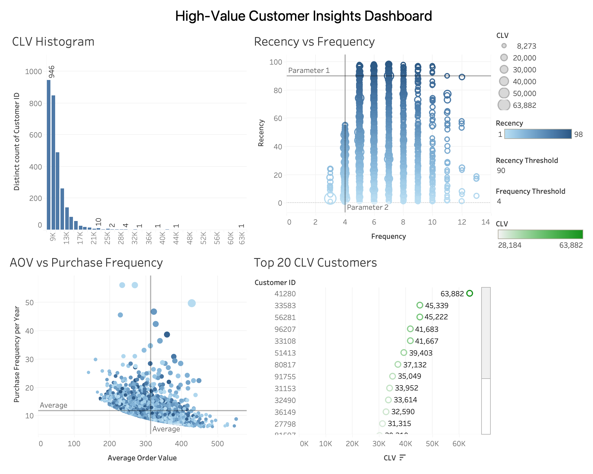

# High-Value Customer Insights – E-commerce Analysis

## Project Overview
This project demonstrates an **end-to-end customer analytics workflow** for an e-commerce dataset, including:

- **Data Acquisition & Cleaning** – Handling missing values, correcting data types, and removing duplicates.  
- **Exploratory Analysis** – Analyzing customer purchase patterns, payment preferences, and repeat purchase rates.  
- **RFM Analysis** – Scoring customers by Recency, Frequency, and Monetary value.  
- **CLV (Customer Lifetime Value) Calculation** – Estimating long-term customer value based on purchasing behavior.  
- **Customer Segmentation** – Identifying high-value customers for targeted marketing strategies.  
- **Visualization Dashboard** – Developed in Tableau to present key insights.  

---

## Dataset Description
**Source:** [Kaggle – Retail Analysis Large Dataset](https://www.kaggle.com/datasets/sahilprajapati143/retail-analysis-large-dataset/data)  

This dataset contains **300,000+ retail transaction records**, covering customer demographics, purchase behavior, and product details.

### Key Features
- **Customer Information:** ID, name, email, phone, address, city, state, zipcode, country, age, gender, and customer segment (Premium, Regular, New).  
- **Transaction Details:** Transaction ID, last purchase date, total purchases, amount spent, total purchase amount, feedback, shipping method, payment method, order status.  
- **Product Information:** Product category, brand, and type (e.g., electronics, clothing, grocery, books, home decor).  
- **Geographic Information:** City, state, country (USA, UK, Canada, Australia, Germany).  
- **Temporal Information:** Year, month, date, and time for purchase events, enabling time-series trend analysis.  

---

## Data Processing and Analysis Steps

1. **Data Preparation** – Loaded Kaggle dataset, removed rows with missing key fields, standardized data types, and converted date columns.  
2. **Basic Metrics** – Calculated average purchases per customer, repeat purchase rate, and payment method distribution.  
3. **RFM Analysis** – Computed Recency, Frequency, and Monetary values; assigned 1–5 scores; segmented into High-, Mid-, and Low-Value groups.  
4. **CLV Calculation** – Estimated using average order value, purchase frequency, and a 3-year lifespan; segmented into Low, Medium, and High tiers.  
5. **Target Customer Selection** – Identified customers ranked High in both RFM and CLV for marketing.  

---

## Visualization Dashboard (Tableau)

**Dashboard Overview**  
  

---

## Code Execution Example

**Python Script Output**  
  

---

## How to Run

1. Download the dataset from Kaggle and place it in the `data/` folder as `new_retail_data.csv`.  
2. Run `analysis_pipeline.py` to generate RFM, CLV, and target customer outputs.  
3. Open `high_value_customer_dashboard.twbx` in Tableau and connect to the generated CSV files.  

---
