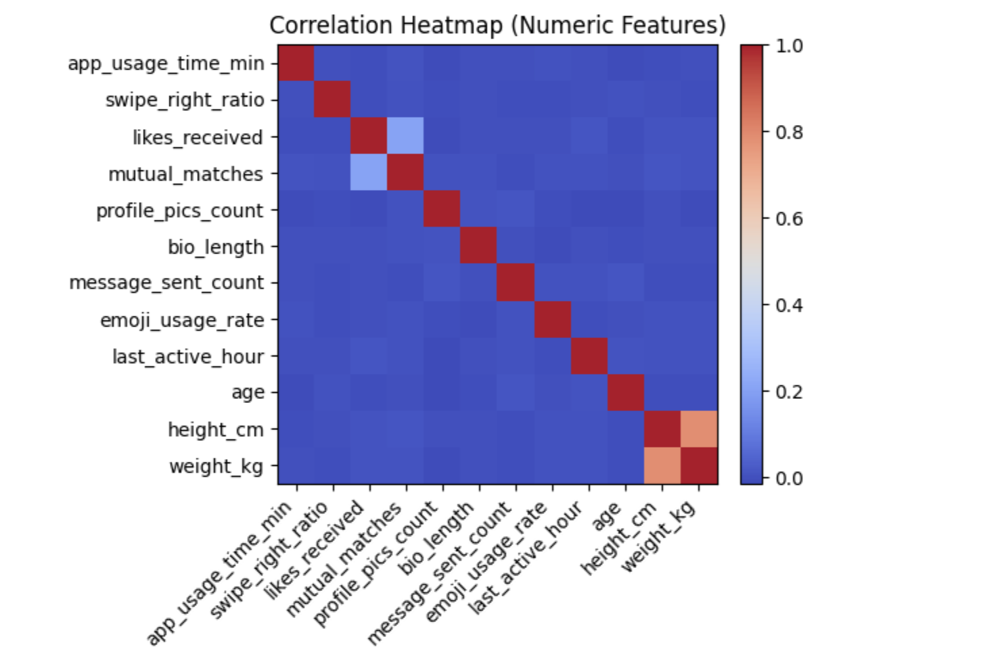
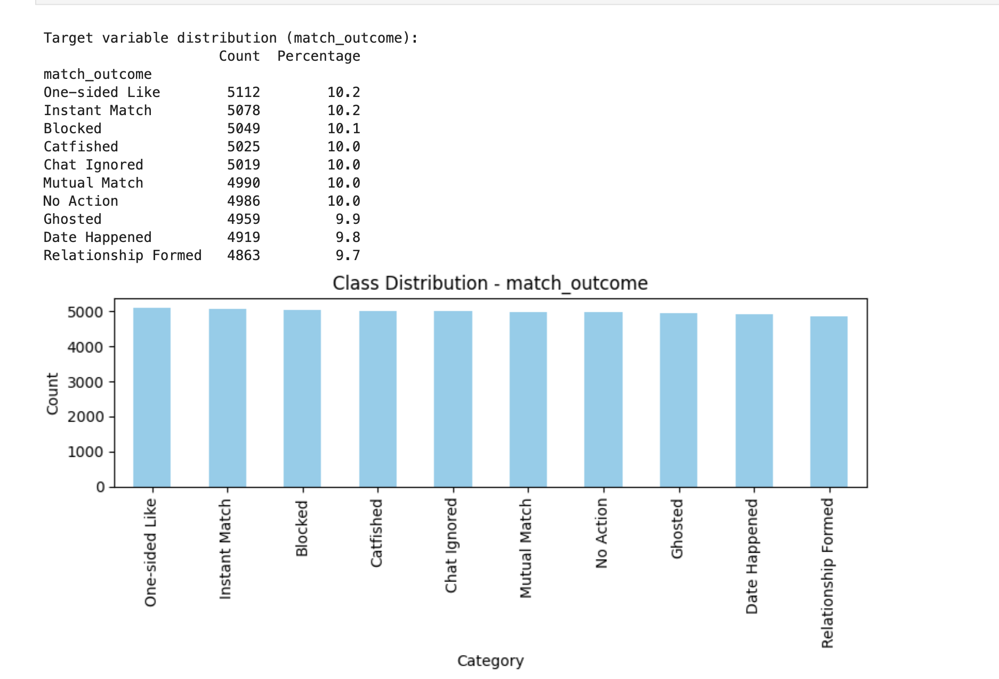
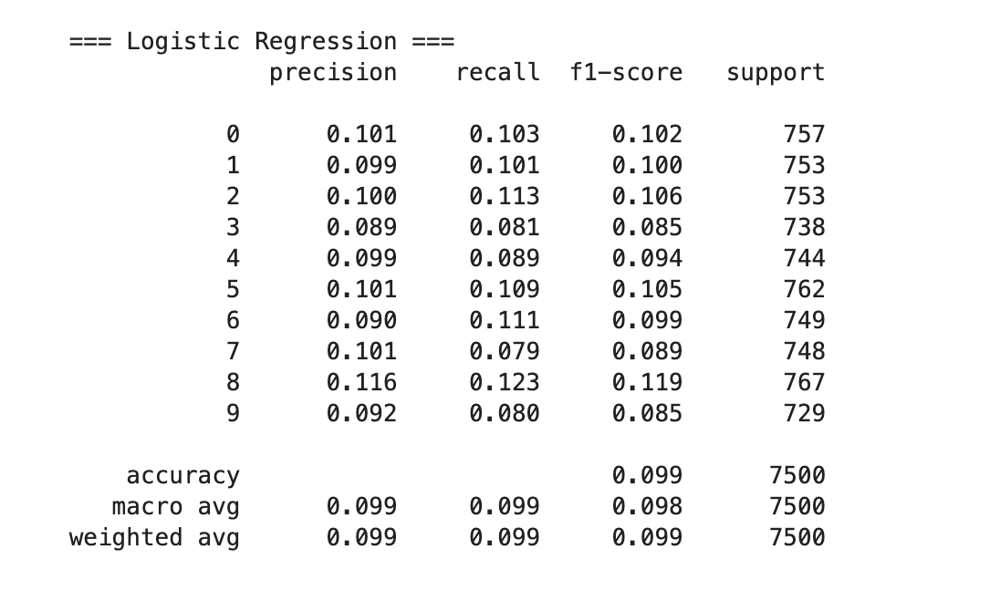
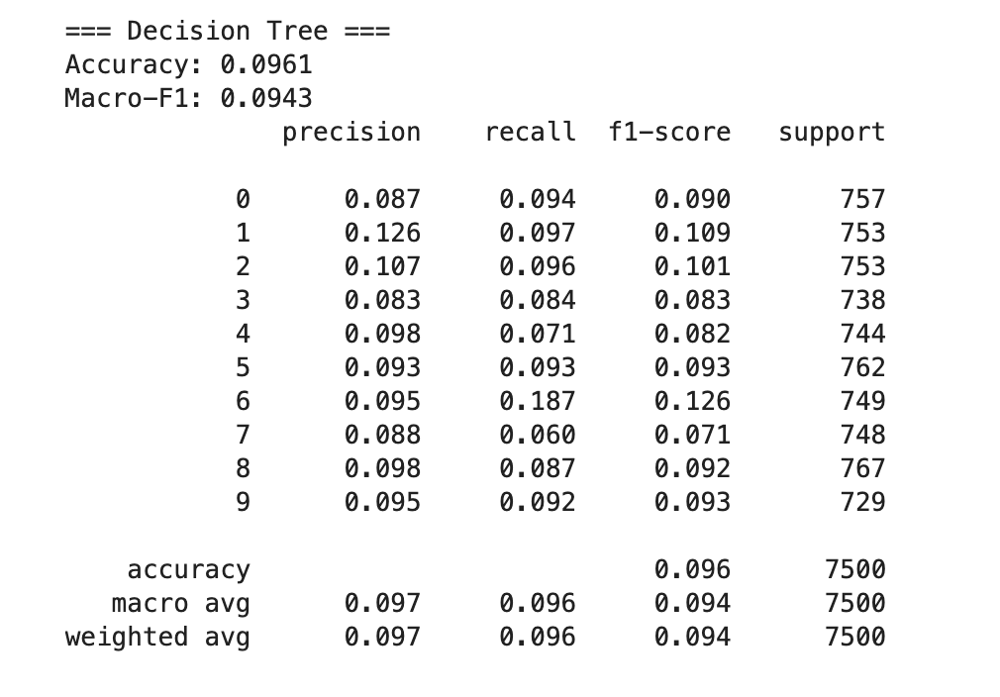
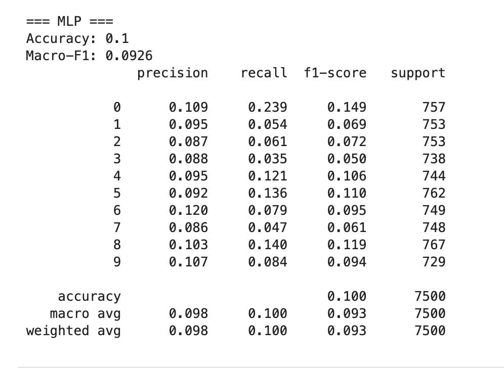

# Predicting Match Outcomes on a Dating App

This project explores whether match outcomes on a fictional dating app can be predicted using behavioral and profile-level features. The dataset comes from Kaggle and includes 50,000 user records with 19 features, simulating real-world online dating behavior.

## Dataset Overview

The dataset includes:

- **Demographic features**: Gender, sexual orientation, income, education
- **Behavioral metrics**: App usage time, swipe ratio, likes received
- **Interests**: Multi-tag interest descriptions (e.g., "Fitness, Cooking, Anime")
- **Label**: Match outcome (10 classes such as `Ghosted`, `Mutual Match`, `Blocked`, etc.)

Source: [Kaggle - Dating App Behavior Dataset](https://www.kaggle.com/datasets/keyushnisar/dating-app-behavior-dataset/data)

## Objective

To determine whether user demographics and behavior metrics can predict final match outcomes, using:

- **Logistic Regression**
- **XGBoost**
- **Deep Learning (Keras MLP)**

## Methodology

- **Preprocessing**:
  - Top-K encoding for high-cardinality categorical columns
  - One-hot encoding of categorical variables
  - Normalization using `MaxAbsScaler`
- **Feature Selection**:
  - Variance Thresholding
  - Mutual Information (SelectKBest)
  - L1-penalized Logistic Regression
- **Modeling & Evaluation**:
  - Multi-class classification using logistic regression (L2), XGBoost, and deep learning
  - Evaluated using accuracy and macro-F1 score
 
## EDA

### Correlation Heat Map(Numeric Features)

### MatcH Outcome Distribution (Catagorical Feature)

## Results

| Model               | Accuracy | Macro F1 |
|--------------------|----------|----------|
| Logistic Regression | 0.1006   | 0.0997   |
| XGBoost             | 0.1003   | 0.1002   |
| Deep Learning       | 0.0999   | 0.0970   |

All models performed close to random guessing on the 10 equally-distributed classes.

### Confusion Matrix (Logistic Regression)

### Confusion Matrix (Decision Tree)

### Confusion Matrix (MLP)

## Interpretation

The results suggest that behavioral data and textual interests alone are insufficient for accurately predicting match outcomes. 

In dating apps, visual impressions play a central role. Profile photos are often the first and most decisive factor in user decision-making. Since the dataset does not include visual data, it is reasonable to assume that key determinants of user matching behavior are missing from this analysis.

## Future Work

- Integrate image data (e.g., profile photo embeddings from CNN)
- Incorporate chat or text interaction patterns
- Explore time-series behavior or latent trait modeling

